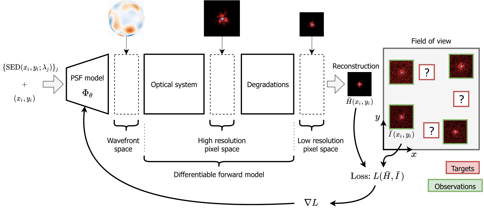

[](https://arxiv.org/abs/0000.00000) [](https://arxiv.org/abs/2111.12541) [](https://www.python.org/dev/peps/pep-0008/) [](https://github.com/tobias-liaudat/wf-psf/tree/master/LICENSE)
# wf-psf: WaveDiff PSF model

A differentiable data-driven wavefront-based PSF model framework.


## Proposed framework

A schematic of the proposed framework can be seen below. The PSF model is estimated (trained) using star observations in the field-of-view.



Visual reconstruction example of the WaveDiff-original PSF model trained on a simplified Euclid-like setting.


## Install

`wf-psf` is pure python and can be easily installed with `pip`:

```
$ cd wf-psf
$ pip install .
```

The package can then be imported in Python as `import wf_psf`.

## Requirements
- [numpy](https://github.com/numpy/numpy) [>=1.19.2]
- [scipy](https://github.com/scipy/scipy) [>=1.5.2]
- [TensorFlow](https://www.tensorflow.org/) [==2.4.1]
- [TensorFlow Addons](https://github.com/tensorflow/addons) [==0.12.1]
- [Astropy](https://github.com/astropy/astropy) [==4.2]
- [zernike](https://github.com/jacopoantonello/zernike) [==0.0.31]
- [opencv-python](https://github.com/opencv/opencv-python) [>=4.5.1.48]
- [pillow](https://github.com/python-pillow/Pillow) [>=8.1.0]
- [galsim](https://github.com/GalSim-developers/GalSim) [>=2.3.1]

Optional packages:
- [matplotlib](https://github.com/matplotlib/matplotlib) [=3.3.2]
- [seaborn](https://github.com/mwaskom/seaborn) [>=0.11]


## Reproducible research

#### [arXiv:0000.00000](https://arxiv.org/abs/0000.00000) 
_Submitted._

- All the scripts, jobs and notebooks to reproduce the figures from the article can be found [here](https://github.com/tobias-liaudat/wf-psf/tree/main/papers/article_IOP).
- The trained PSF models are found [here](https://github.com/tobias-liaudat/wf-psf/tree/main/papers/article_IOP/data/models).
- The input PSF field can be found [here](https://github.com/tobias-liaudat/wf-psf/tree/main/data).
- The script used to generate the input PSF field is [this one](https://github.com/tobias-liaudat/wf-psf/blob/main/long-runs/LR-PSF-field-gen-coherentFields.py).
- The code required to run the comparison against pixel-based PSF models is in [this directory](https://github.com/tobias-liaudat/wf-psf/tree/main/method-comparison).
- The training of the models was done using [this script](https://github.com/tobias-liaudat/wf-psf/blob/main/long-runs/train_eval_plot_script_click.py). In order to match the script's option for the different models with the article you should follow: 
    - `poly->WaveDiff-original`
    - `graph->WaveDiff-graph`
    - `mccd->WaveDiff-Polygraph`

_Note: To run the comparison to other PSF models you need to install them first. See [RCA](https://github.com/CosmoStat/rca), [PSFEx](https://github.com/astromatic/psfex) and [MCCD](https://github.com/CosmoStat/mccd)._


#### [arXiv:2111.12541](https://arxiv.org/abs/2111.12541) 
_NeurIPS 2021 Workshop on Machine Learning and the Physical Sciences._

- All the scripts, jobs and notebooks to reproduce the figures from the article can be found [here](https://github.com/tobias-liaudat/wf-psf/tree/main/papers/Neurips2021_ML4Physics_workshop).


## Citation

If you use `wf-psf` in a scientific publication, we would appreciate citations to the following paper:

[Rethinking data-driven point spread function modeling with a differentiable optical model](https://arxiv.org/abs/0000.00000), T. Liaudat, J.-L. Starck, M. Kilbinger, P.-A. Frugier, submitted, 2022.


The BibTeX citation is the following:
```
@Upcomming
```

