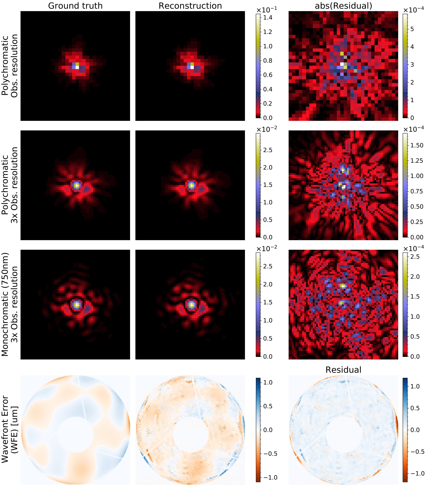

[](http://arxiv.org/abs/2203.04908) [](https://www.python.org/dev/peps/pep-0008/) [](https://github.com/tobias-liaudat/wf-psf/tree/master/LICENSE)

<h1 align='center'>WaveDiff</h1>
<h2 align='center'>A differentiable data-driven wavefront-based PSF modelling framework.</h2>

This repository includes:
- A differentiable PSF model entirely built in [Tensorflow](https://github.com/tensorflow/tensorflow).
- A numpy-based PSF simulator [here](https://github.com/tobias-liaudat/wf-psf/blob/main/wf_psf/SimPSFToolkit.py).
- All the scripts, jobs and notebooks required to reproduce the results in [arXiv:2203.04908](http://arxiv.org/abs/2203.04908) and [arXiv:2111.12541](https://arxiv.org/abs/2111.12541).

~~For more information on how to use the WaveDiff model through configurable scripts see the `long-runs` directory's [README](https://github.com/tobias-liaudat/wf-psf/blob/main/long-runs/README.md).~~ (Scripts will become obsolute with next release.) 

## Proposed framework

A schematic of the proposed framework can be seen below. The PSF model is estimated (trained) using star observations in the field-of-view.


<!-- Visual reconstruction example of the WaveDiff-original PSF model trained on a simplified Euclid-like setting.

 -->


## Requirements
- [numpy](https://github.com/numpy/numpy) [>=1.19.2]
- [scipy](https://github.com/scipy/scipy) [>=1.5.2]
- [TensorFlow](https://www.tensorflow.org/) [>=2.4.1, <2.13.0]
- [TensorFlow Addons](https://github.com/tensorflow/addons) [==0.12.1]
- [Astropy](https://github.com/astropy/astropy) [==4.2]
- [zernike](https://github.com/jacopoantonello/zernike) [==0.0.31]
- [opencv-python](https://github.com/opencv/opencv-python) [>=4.5.1.48]
- [pillow](https://github.com/python-pillow/Pillow) [>=8.1.0]
- [galsim](https://github.com/GalSim-developers/GalSim) [>=2.3.1]

Optional packages:
- [matplotlib](https://github.com/matplotlib/matplotlib) [=3.3.2]
- [seaborn](https://github.com/mwaskom/seaborn) [>=0.11]
- [PyYaml](https://github.com/yaml/pyyaml) [>=6.0]
- [scikit-image](https://github.com/scikit-image/scikit-image) [>=0.21.0]

## Install

`wf-psf` is pure python and can be easily installed with `pip`. After cloning the repository, run the following commands:

```bash
$ cd wf-psf
$ git checkout dummy_main
$ pip install .
$ pip install -r requirements.txt
```

The package can then be imported in Python as `import wf_psf as wf`. ~~We recommend using the release `1.2.0` for stability as the current main branch is under development.~~

## Running `WaveDiff`

To run `WaveDiff`, we prepared a step-by-step [instruction guide](https://github.com/CosmoStat/wf-psf/wiki/Getting-started-tutorial).

[Read the tutorial to get started!](https://github.com/CosmoStat/wf-psf/wiki/Getting-started-tutorial)

## Reproducible research

#### [arXiv:2203.04908](http://arxiv.org/abs/2203.04908) Rethinking data-driven point spread function modeling with a differentiable optical model (2022)
_Submitted._

- Use the release 1.2.0.
- All the scripts, jobs and notebooks to reproduce the figures from the article can be found [here](https://github.com/tobias-liaudat/wf-psf/tree/main/papers/article_IOP).
- The trained PSF models are found [here](https://github.com/tobias-liaudat/wf-psf/tree/main/papers/article_IOP/data/models).
- The input PSF field can be found [here](https://github.com/tobias-liaudat/wf-psf/tree/main/data).
- The script used to generate the input PSF field is [this one](https://github.com/tobias-liaudat/wf-psf/blob/main/long-runs/LR-PSF-field-gen-coherentFields.py).
- The code required to run the comparison against pixel-based PSF models is in [this directory](https://github.com/tobias-liaudat/wf-psf/tree/main/method-comparison).
- The training of the models was done using [this script](https://github.com/tobias-liaudat/wf-psf/blob/main/long-runs/train_eval_plot_script_click.py). In order to match the script's option for the different models with the article you should follow: 
    - `poly->WaveDiff-original`
    - `graph->WaveDiff-graph`
    - `mccd->WaveDiff-Polygraph`

_Note: To run the comparison to other PSF models you need to install them first. See [RCA](https://github.com/CosmoStat/rca), [PSFEx](https://github.com/astromatic/psfex) and [MCCD](https://github.com/CosmoStat/mccd)._


#### [arXiv:2111.12541](https://arxiv.org/abs/2111.12541) Rethinking the modeling of the instrumental response of telescopes with a differentiable optical model (2021)
_NeurIPS 2021 Workshop on Machine Learning and the Physical Sciences._

- Use the release 1.2.0.
- All the scripts, jobs and notebooks to reproduce the figures from the article can be found [here](https://github.com/tobias-liaudat/wf-psf/tree/main/papers/Neurips2021_ML4Physics_workshop).


## Citation

If you use `wf-psf` in a scientific publication, we would appreciate citations to the following paper:

*Rethinking data-driven point spread function modeling with a differentiable optical model*, T. Liaudat, J.-L. Starck, M. Kilbinger, P.-A. Frugier, [arXiv:2203.04908](http://arxiv.org/abs/2203.04908), 2022.


The BibTeX citation is the following:
```
@misc{https://doi.org/10.48550/arxiv.2203.04908,
  doi = {10.48550/ARXIV.2203.04908},
  
  url = {https://arxiv.org/abs/2203.04908},
  
  author = {Liaudat, Tobias and Starck, Jean-Luc and Kilbinger, Martin and Frugier, Pierre-Antoine},
  
  keywords = {Instrumentation and Methods for Astrophysics (astro-ph.IM), Computer Vision and Pattern Recognition (cs.CV), FOS: Physical sciences, FOS: Physical sciences, FOS: Computer and information sciences, FOS: Computer and information sciences},
  
  title = {Rethinking data-driven point spread function modeling with a differentiable optical model},
  
  publisher = {arXiv},
  
  year = {2022},
  
  copyright = {arXiv.org perpetual, non-exclusive license}
}
```

