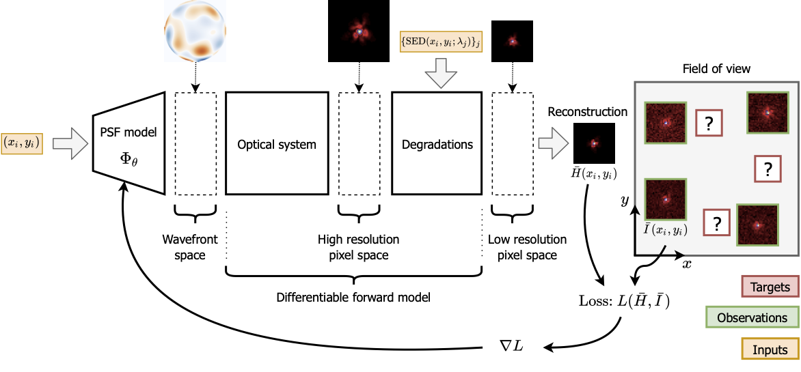

# About

WaveDiff {cite:p}`Liaudat:23` is a differentiable data-driven wavefront-based PSF modelling framework in TensorFlow.  It's a hybrid methodology that constructs a model of the PSF across the telescope's field-of-view by combining a forward parametric model of the wavefront with non-parametric data-driven techniques used to correct forward model errors in the wavefront space.  WaveDiff has been especially designed for the European Space Agency's [Euclid Mission](https://www.esa.int/Science_Exploration/Space_Science/Euclid) to ensure the mission can achieve and exceed its core science performance requirements for weak gravitational lensing. 

A diagram of the WaveDiff framework is presented below. The PSF model for the instrument is estimated by training the parameters of the model using star observations in the field-of-view.

